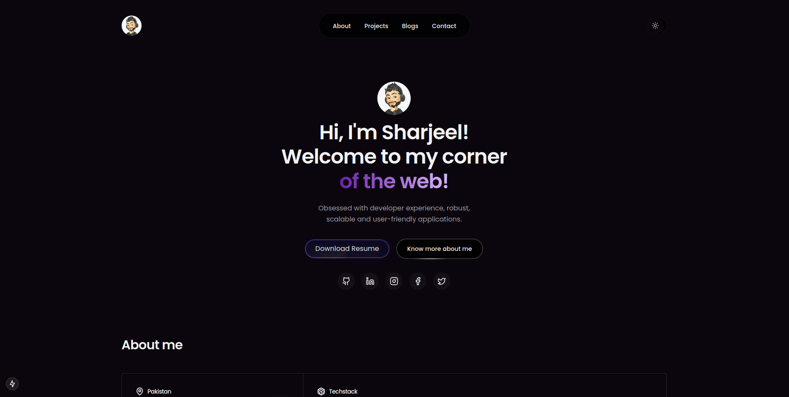

# 🧑‍💻 Sharjeel's Developer Portfolio

Welcome to the source code for my personal developer portfolio! This site showcases my skills, projects, blog posts, and contact information — built with a strong focus on user experience, elegant design, and developer performance.

## 🌐 Live Site

👉 [Visit Portfolio](https://your-portfolio-link.com)

---

## 📸 Preview



---

## ✨ Features

- 🎯 Clean, modern, responsive UI with dark mode
- ⚛️ Built with Next.js 15 and React 19
- ⚙️ Animations powered by Framer Motion & GSAP
- 🌗 Theme switcher with `next-themes`
- 🛠️ Accessible components using Radix UI
- 📚 Blog system and project showcase
- 📩 Fully functional contact form

---

## 🛠 Tech Stack

- **Frameworks**: Next.js 15, React 19
- **Styling**: Tailwind CSS, Tailwind Merge
- **Animations**: Framer Motion, GSAP
- **UI Components**: Radix UI, Lucide React
- **Forms & Validation**: React Hook Form + Zod
- **Icons**: Tabler, Lucide, React Icons

---

## 🚀 Getting Started

Clone the repo and install dependencies.

```bash
git clone https://github.com/yourusername/portfolio.git
cd portfolio
npm install
npm run dev
